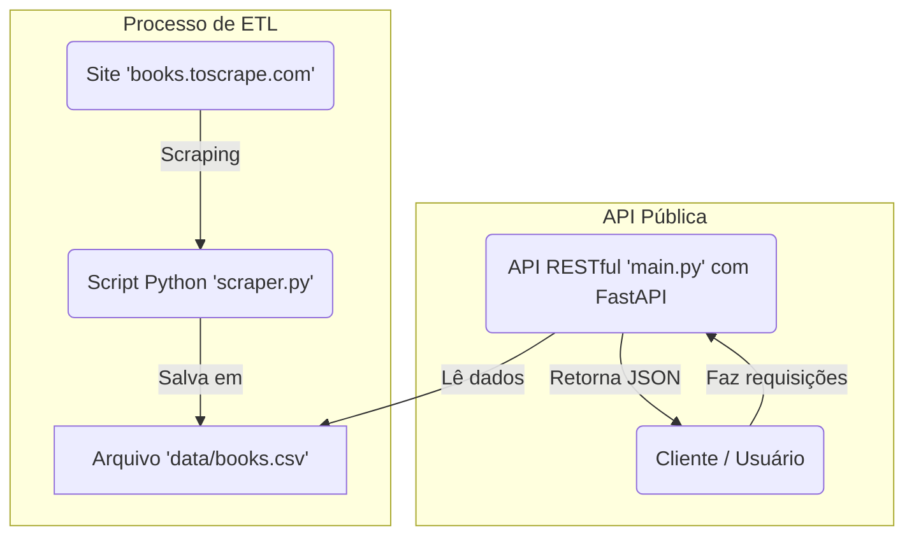

# 🚀 Tech Challenge: API de Coleta de Livros

Este projeto é uma solução completa para o Tech Challenge, que consiste na criação de um pipeline de dados e uma API pública para consulta de livros. O sistema extrai dados de livros do site `books.toscrape.com` e os disponibiliza através de uma API RESTful para consumo por cientistas de dados ou serviços de recomendação.

---

## 🏛️ Diagrama da Arquitetura

O diagrama abaixo detalha o fluxo de dados do projeto, desde a ingestão (scraping) até o consumo pela API.



*(Este bloco de código `mermaid` será renderizado automaticamente como um diagrama visual pelo GitHub.)*

---

## 🛠️ Como Reproduzir o Projeto

Siga os passos abaixo para executar o projeto localmente.

### Pré-requisitos

* Python 3.8+
* pip (ou pip3)
* Ambiente virtual (venv) - recomendado

### Passos para Instalação

1. **Clone o repositório:**

    ```bash
    git clone [https://github.com/VitorFlora/book-crawler.git](https://github.com/VitorFlora/book-crawler.git)
    cd book-crawler
    ```

2. **(Opcional, mas recomendado) Crie um ambiente virtual:**

    ```bash
    python -m venv venv
    source venv/bin/activate  # No Windows: venv\Scripts\activate
    ```

3. **Instale as dependências:**

    ```bash
    pip install -r requirements.txt
    ```

4. **Execute o Web Scraper:**
    Este script irá coletar os dados e criar o arquivo `data/books.csv`.

    ```bash
    python scraper.py
    ```

5. **Inicie a API (Servidor Local):**

    ```bash
    uvicorn main:app --reload
    ```

O servidor estará disponível em `http://127.0.0.1:8000`.

---

## 🗺️ Documentação dos Endpoints da API

Abaixo estão os endpoints obrigatórios disponíveis. Você também pode acessar a documentação interativa (Swagger) gerada automaticamente pelo FastAPI em `http://127.0.0.1:8000/docs`.

### `GET /api/v1/health`

Verifica o status da API.

* **Resposta (Sucesso 200):**

    ```json
    {
      "status": "ok",
      "message": "API está funcionando normalmente."
    }
    ```

### `GET /api/v1/books`

Lista todos os livros disponíveis na base de dados.

* **Resposta (Sucesso 200):**

    ```json
    [
      {
        "id": 0,
        "title": "A Light in the Attic",
        "category": "Poetry",
        "price": "£51.77",
        "rating": 3,
        "availability": 22,
        "image_url": "[https://books.toscrape.com/media/cache/2c/da/2cdad67c44b002e7ead0cc35693c0e8b.jpg](https://books.toscrape.com/media/cache/2c/da/2cdad67c44b002e7ead0cc35693c0e8b.jpg)"
      },
      ...
    ]
    ```

### `GET /api/v1/books/{book_id}`

Retorna os detalhes completos de um livro específico pelo ID.

* **Exemplo de Chamada:** `GET /api/v1/books/5`
* **Resposta (Sucesso 200):**

    ```json
    {
      "id": 5,
      "title": "Soumission",
      "category": "Fiction",
      "price": "£50.10",
      "rating": 1,
      "availability": 20,
      "image_url": "[https://books.toscrape.com/media/cache/3e/ef/3eef99c9d9adef34639f510662022830.jpg](https://books.toscrape.com/media/cache/3e/ef/3eef99c9d9adef34639f510662022830.jpg)"
    }
    ```

### `GET /api/v1/books/search`

Busca livros por título e/ou categoria.

* **Exemplo de Chamada (Título):** `GET /api/v1/books/search?title=prince`
* **Exemplo de Chamada (Categoria):** `GET /api/v1/books/search?category=Music`
* **Exemplo de Chamada (Ambos):** `GET /api/v1/books/search?title=a&category=Poetry`
* **Resposta (Sucesso 200):**

    ```json
    [
      {
        "id": 50,
        "title": "The Little Prince",
        ...
      }
    ]
    ```

### `GET /api/v1/categories`

Lista todas as categorias de livros disponíveis.

* **Resposta (Sucesso 200):**

    ```json
    {
      "categories": [
        "Poetry",
        "Fiction",
        "Music",
        ...
      ]
    }
    ```

---

## 🚀 Links da Entrega

* **Link do Deploy:** `https://book-crawler-mub1.onrender.com`
* **Link do Vídeo:** ``
